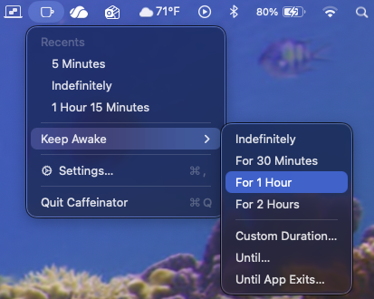
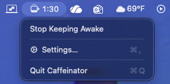
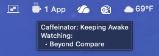
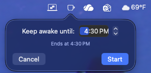
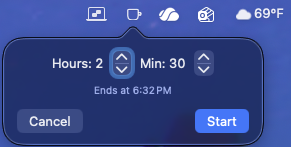
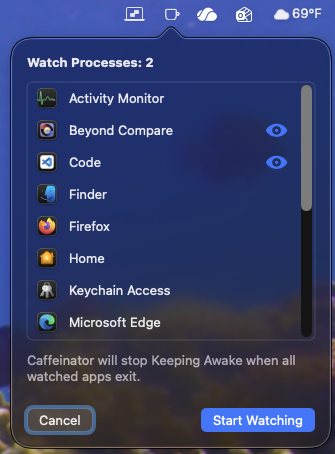
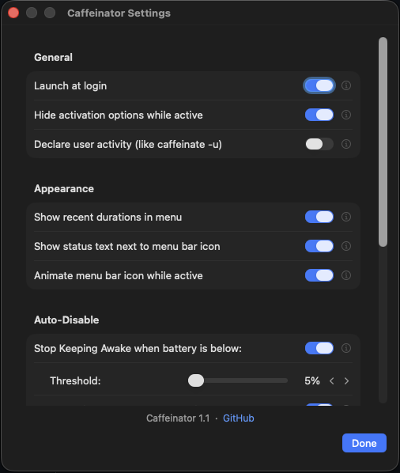
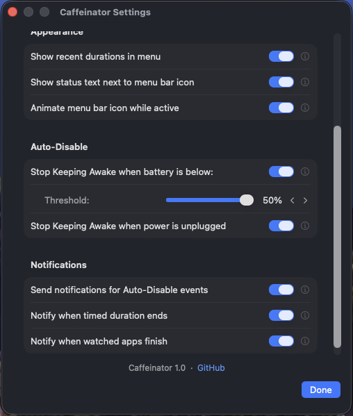

<p align="center">
  
</p>

# **Caffeinator**
A polished, lightweight, native macOS menu bar utility to keep your Mac awake when you want, and without fuss.

---

## Features

- **Menu Bar Control** — One click to keep your Mac awake.
- **Smart Durations** — Choose from presets or set a custom timer.
- **Watched Apps** — Automatically stay awake when selected apps are running.
- **MRU Durations** — Your most-used durations appear automatically.
- **Animated Icon** — Subtle animation runs while Keep Awake is active.
- **Launch at Login** — Optional and fully sandbox‑compliant.
- **Universal Binary** — Runs natively on both Apple Silicon and Intel Macs.
- **Privacy‑Respecting** — No telemetry, no network access, no data collection of any kind.

---

## Installation

### Download

Grab the latest notarized release from GitHub:

➡️ **[Download Caffeinator](https://github.com/bbauder/caffeinator/releases/latest)**

You’ll receive a file named: Caffeinator.zip

### Install

1. Unzip the file  
2. Drag **Caffeinator.app** into your **/Applications** folder  
3. Launch it from Applications  
4. (Optional) Enable **Launch at Login** in Settings  

---

## Requirements

- **macOS 14 Sonoma or later**  
- **Intel or Apple Silicon**  

Caffeinator uses modern Swift concurrency features (`MainActor.assumeIsolated`) that require Sonoma or newer.

---

## Security & Trust

Caffeinator is production‑grade:
- Signed with a **Developer ID Application** certificate  
- Notarized by Apple  
- Stapled for offline verification  
- Gatekeeper‑friendly  

You can verify the signature manually:
```
spctl -v --assess --type exec /Applications/Caffeinator.app
```
Expected output:<br>
accepted<br>
source=Notarized Developer ID<br>

---

## Screenshots

### Inactive State


### Inactive — Full Menu (Cascaded)


### Active — Indefinite Mode


### Active — Counting Down


### Active — Countdown with Menu Visible


### Active — Watching Apps (Tooltip Visible)


### Keep Awake Until — Popover


### Custom Duration — Popover


### Watch Processes Popover


---

<details>
<summary><strong>More Screenshots</strong></summary>
<br>

### Settings


### Settings — Scrolled to Bottom


</details>

---

## Development

Caffeinator is built with:
- Swift 5.10+  
- SwiftUI  
- Xcode 26.5  
- Modern macOS APIs  
- A clean, modular architecture built on the MVVM (Model-View-ViewModel) pattern

The project structure follows a modern layout emphasizing clear separation of concerns.<br>
The workspace contains 162 unit tests.<br>
User-facing strings have been localized into 23 different locales.<br>

---

## Building from Source

Clone the repo:
```
git clone https://github.com/bbauder/caffeinator.git
```
Open the workspace in Xcode and build the **Caffeinator** target.

---

## 📄 License

Released under the [MIT License](LICENSE).

---

## 🙌 Acknowledgments

Caffeinator is inspired by the simplicity of classic “keep awake” utilities, but built from scratch with modern SwiftUI, a clean architecture, and a focus on simple workflows and UX.
